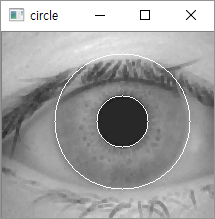
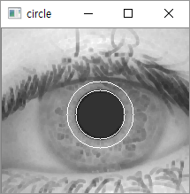
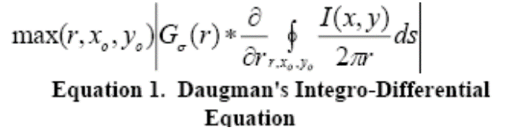

# Iris_segmentation
Iris segmentation using Daughman's Algorithm

---
### Data set  
I used CASIA Data set. You can download from [Here](http://www.cbsr.ia.ac.cn/IrisDatabase/irisdatabase.php)

---
Argument  
- r: Radius of iris ex) --r 60
- e: extension of image format ex) --e bmp
- p: path of root image folder 

---
Requirement library
- OpenCV
- Numpy
---

Process  
Image preprocess and reduce the target pixel, finally adopt Daughman's algortihm for finding IRIS & Pupil.  

In image preprocess, I used threshold and mopology for alleviating light reflections.  
    
[mopology]  
  
[binary]

And then, used crop and local minima for reduce target pixel  
  
[crop]  

  
[local minima]

And result is this.  
  
[okay]

  
[error]

---

#Daughman's algorithm

It scanned [0:x][0:y][0:r] on image and use this expression  
  

[expression]

---
##Reference
[1] [https://www.diva-portal.org/smash/get/diva2:831173/FULLTEXT01.pdf](https://www.diva-portal.org/smash/get/diva2:831173/FULLTEXT01.pdf)